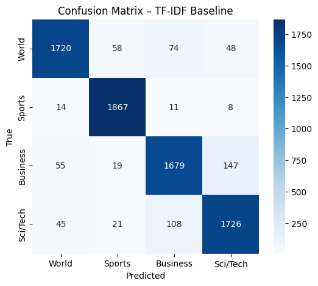
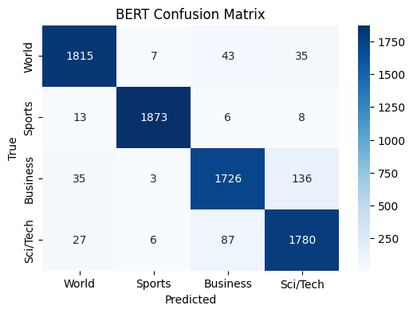

# 📰 Multi-Level News Classifier — TF-IDF vs BERT

This project compares two text classification approaches on the **AG News dataset**:
1. **Baseline:** TF-IDF + Logistic Regression  
2. **Advanced:** Fine-tuned BERT (`bert-base-uncased`)  

---

## 📊 Dataset
The [AG News dataset](https://www.kaggle.com/datasets/amananandrai/ag-news-classification-dataset) contains **4 categories**:
- World  
- Sports  
- Business  
- Sci/Tech  

Each record has a *Title* and *Description* column.

---

## 📁 Project Structure

```
news-classifier/
│
├── data/
│   ├── train.csv
│   ├── test.csv
│
├── notebooks/
│   ├── 01_EDA.ipynb
│   ├── 01_EDA.html
│   ├── 02_baseline_tfidf.ipynb
│   ├── 02_baseline_tfidf.html
│   ├── 03_bert_finetune.ipynb
│
└── reports/
    ├── tf_idf_baseline_confusion_matrix.png
    ├── bert_confusion_matrix.png
```

---


## 📘 Notebooks (clickable)

| Notebook | Description |
|-----------|--------------|
| [01_EDA.html (nbviewer)](https://nbviewer.org/github/drnursultan/news-classifier-tfidf-bert/blob/main/notebooks/01_EDA.html) | Exploratory Data Analysis |
| [02_Baseline_TFIDF.html (nbviewer)](https://nbviewer.org/github/drnursultan/news-classifier-tfidf-bert/blob/main/notebooks/02_baseline_tfidf.html) | TF-IDF Baseline Model |
| [03_bert_finetune_clean.html](notebooks/03_bert_finetune_clean.html) | Fine-Tuned BERT Model |

---

## 🧠 Model Comparison

| Metric | TF-IDF + Logistic Regression | BERT (Fine-Tuned) |
|:-------|:-----------------------------:|:-----------------:|
| Accuracy | **0.92** | **0.95** |
| Precision (avg) | 0.92 | 0.95 |
| Recall (avg) | 0.92 | 0.95 |
| F1-Score (avg) | 0.92 | 0.95 |
| Training Epochs | – | 2 |
| Training Loss (last) | – | 0.1120 |
| Validation Loss (last) | – | 0.1886 |

---

## 📈 Confusion Matrices

| TF-IDF | BERT |
|:------:|:----:|
|  |  |

---

## 🧩 Evaluation Reports

### BERT Report
```
          precision    recall  f1-score   support

   World       0.96      0.96      0.96      1900
  Sports       0.99      0.99      0.99      1900
Business       0.93      0.91      0.92      1900
Sci/Tech       0.91      0.94      0.92      1900

accuracy                           0.95      7600
```

```
macro avg          0.95      0.95      0.95      7600
weighted avg       0.95      0.95      0.95      7600
```
### TF-IDF Report

```
          precision    recall  f1-score   support

       1       0.94      0.91      0.92      1900
       2       0.95      0.98      0.97      1900
       3       0.90      0.88      0.89      1900
       4       0.89      0.91      0.90      1900

accuracy                           0.92      7600
```

```
macro avg          0.92      0.92      0.92      7600
weighted avg       0.92      0.92      0.92      7600
````
---

## 🧠 Summary

| Model | Strength | Weakness |
|--------|-----------|-----------|
| **TF-IDF** | Fast, interpretable | Ignores word context |
| **BERT** | Understands meaning, higher accuracy | Slow to train, needs GPU |

---

## 🚀 How to Run

1. Open the notebook in **Google Colab**  
2. Mount your Google Drive and load the dataset  
3. Run `03_bert_finetune.ipynb` (enable GPU)  

To compare, open the HTML reports above for metrics and visual results.

---

## 🏷️ Author
Developed by **Nursultan Azhimuratov**  
University of Wisconsin–Madison | Data Science & NLP Projects
